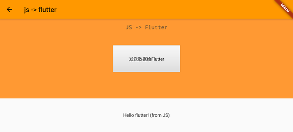

# 玩转flutter的webview

## 官方库：webview_flutter

添加库 webview_flutter

pubspec.yaml:
```yaml
#...
dependencies:
  flutter:
    sdk: flutter
  webview_flutter: ^1.0.0
#...
```
## 加载url

### 引入控件
url.dart
```dart
import 'package:webview_flutter/webview_flutter.dart';

class UrlPage extends StatelessWidget {
  @override
  Widget build(BuildContext context) {
    return Scaffold(
      //...
      body: WebView(
        initialUrl: "https://github.com/caojianfeng/webview_demo",
      ),
    );
  }
}

```

### android增加权限

刚创建的flutter工程，android/app/src/profile/AndroidManifest.xml中默认会带有权限android.permission.INTERNET.

android/app/src/profile/AndroidManifest.xml:
```xml
<manifest xmlns:android="http://schemas.android.com/apk/res/android"
    package="com.github.caojianfeng.webview_demo">
    <!-- ...  -->
    <uses-permission android:name="android.permission.INTERNET"/>
    <!-- ...  -->
</manifest>

```

但是如果你的url中使用了http或者重定向跳转到http，往往会遇到这样的错误：

```text
net::ERR_CLEARTEXT_NOT_PERMITTED
```

这时候，你需要打开application的usesCleartextTraffics开关

android/app/src/main/AndroidManifest.xml:
```xml
<manifest xmlns:android="http://schemas.android.com/apk/res/android"
    package="com.github.caojianfeng.webview_demo">
    <application
        ...
        android:hardwareAccelerated="true"
        ...
        >
        <!-- ...  -->
    </application>
</manifest>

```


## 加载本地html

### 添加本地文件

虽然文件可以添加到任意位置，最好还是有个规划。
这里我们新建html目录，将文件放在这个目录下。

html/hello.html
```html
<!DOCTYPE html>
<html lang="en">
<!-- ... --->  
<body>
    <p id=title>Hello webview_flutter!</p>
    <p id=content>1. Put you 'hello.html' in dir like 'html/'.</p>
    <p id=content>2. Def assets in you pubspec.yaml.</p>
    <p id=content>3. Load html/hello.html.</p>
</body>
</html>

```

### assets中声明你的文件
pubspec.yaml:
```yaml
#...
dependencies:
  #...

dev_dependencies:
  #...
  
#...
flutter:
  #...
  assets:
    - html/hello.html
#...
```
一定要注意缩进，assets是flutter的子节点。否则无法将html文件打包。

### 加载文件数据

与加载url不同的是，本地文件的加载需要从assets里面读取数据，
然后将数据直接传递给webview。


```dart
import 'dart:convert';
import 'package:flutter/material.dart';
import 'package:webview_flutter/webview_flutter.dart';
import 'package:flutter/services.dart';

class LocalPage extends StatelessWidget {
  @override
  Widget build(BuildContext context) {
    return Scaffold(
      //...
      body: WebView(
        initialUrl: "",
        onWebViewCreated: (WebViewController webViewController) {
          _loadHtmlFromAssets(webViewController);
        },
      ),
    );
  }

  _loadHtmlFromAssets(webViewController) async {
    String fileText = await rootBundle.loadString('html/hello.html');
    webViewController.loadUrl(Uri.dataFromString(fileText,
            mimeType: 'text/html', encoding: Encoding.getByName('utf-8'))
        .toString());
  }
}

```

rootBundle.loadString 
```
将会加载assets下的html/hello.html文件内容
```

Uri.dataFromString
```
将会对文件内容做utf8编码，生成字符串：“data:text/html;charset=utf-8,【内容utf8编码】”
如果你愿意还可以进行base64编码。
```

注意：
1. initialUrl 需要传入空字符串''或者'about:blank'
2. onWebViewCreated 你可以拿到WebViewController实例，后面需要通过它设置加载后的html字符串。
3. 文件的加载则是异步的，_loadHtmlFromAssets 带上 async 。


## 启用JavaScript
flutter中的WebView默认是不允许的JavaScript的，javascriptMode的默认值是disable.
此时如果加载下面的 hellojs.html,
```html
<!DOCTYPE html>
<html lang="en">
<!-- ... --->  
<body>
    <p id=title>Hello webview_flutter!</p>
    <script>
        document.getElementById("title").innerHTML = "Hello JavaScript!";
    </script>
</body>
</html>
```
你只能看到“Hello webview_flutter!”

要使用js需要我们将WebView的'javascriptMode'设置为'JavascriptMode.unrestricted'。
```js
//...
class JsPage extends StatelessWidget {
  @override
  Widget build(BuildContext context) {
    return Scaffold(
      //...
      body: WebView(
        javascriptMode: JavascriptMode.unrestricted,
        //...
      ),
    );
  }

  //...
}
```

这样JS代码将会被执行，你就能看到：


## ua设置

注入js

## 交互js->flutter

webview_flutter中提供了javascriptChannels用于js和dart之间通信。

### 在flutter中接收消息
首先需要构建JavascriptChannel对象接收消息
```dart
  //...
  _alertJavascriptChannel() {
    return JavascriptChannel(
        name: 'WebViewReceiver',
        onMessageReceived: (JavascriptMessage message) {
          print('onMessageReceived:${message.message}');
          this._setMessage(message.message);
        });
  }
  //...
}

```

之后在创建WebView的时候需要提供javascriptChannels参数。

```dart
//...
class _Js2FlutterPageState extends State<Js2FlutterPage> {
  //...
  @override
  Widget build(BuildContext context) {
    //...
    return Scaffold(
      //...
              child: WebView(
                //...
                javascriptChannels:
                    <JavascriptChannel>[_alertJavascriptChannel()].toSet(),
              ),
       //...
      ),
    );
  }
}
```


### 在js中发送消息

WebView拿到javascriptChannels，并完成初始化。
JavascriptChannel的name(WebViewReceiver)将会被用来表示一条通道已经建立。
就像水能够接触到容器，html也受到WebView带给html的变化。
现在我们在html中调用window.WebViewReceiver.postMessage就可以给flutter发消息了。

```html
<!DOCTYPE html>
<html lang="en">
<head>
    <!--- ...  --->
    <script>
        function postMsg(event) {
            if (window.WebViewReceiver) {
                window.WebViewReceiver.postMessage('Hello flutter! (from JS)');
            }
        }
    </script>
   <!--- ...  --->
</head>
<body>
    <!--- ...  --->
    <button id=button onclick="postMsg()">发送数据给Flutter</button>
    <!--- ...  --->
</body>
</html>

```


这样在我们点击html中的按钮的时候，js会发消息给名字叫做“WebViewReceiver”的JavascriptChannel。
在Dart一侧的JavascriptChannel的onMessageReceived将会被触发，从而我们拿到了js发来的消息。



## 交互flutter->js

是否弹出浏览器

处理back


